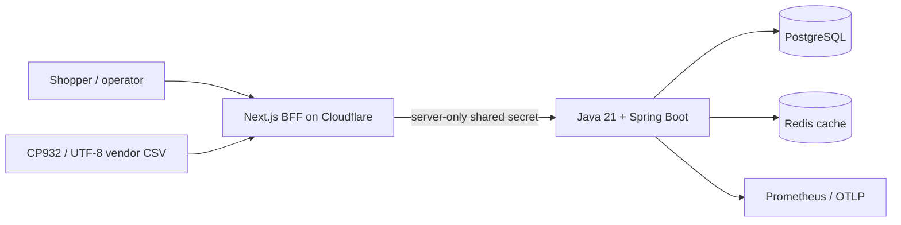

# V-Market Modernization

V-Market is a portfolio-grade commerce system built around a problem common in Japanese outsourcing work: replacing fragile Shift-JIS/CP932 file exchange with a controlled, observable system without interrupting daily operations.

The public storefront is deployable to Cloudflare Workers. A Java 21/Spring Boot API owns the catalog, transactional checkout, inventory, fulfillment, legacy imports, and reconciliation. PostgreSQL is the source of truth; Redis is a fail-open catalog cache.

## Live demo

- Application: [v-market.vmarket-vietdung2005.workers.dev](https://v-market.vmarket-vietdung2005.workers.dev)
- Backend readiness: [v-market-api.onrender.com/actuator/health/readiness](https://v-market-api.onrender.com/actuator/health/readiness)
- Public deployment proof: [docs/evidence/live-deployment.md](docs/evidence/live-deployment.md)
- Short-lived AWS deployment proof: [docs/evidence/aws-deployment.md](docs/evidence/aws-deployment.md)

The backend uses Render's free web-service tier, so the first request after 15 minutes without inbound traffic can take about a minute while the container wakes up.

## Demonstrated capabilities

- Durable guest checkout with server-owned JPY pricing, privacy acknowledgement, idempotency keys, deterministic lock order, and oversell protection.
- Opaque-token order tracking that never returns customer PII.
- Audited, one-step fulfillment transitions in an operations console.
- UTF-8 and CP932 CSV intake, validation quarantine, checksum deduplication, restartable Spring Batch chunks, checkpoints, and post-import reconciliation.
- Redis cache-aside with TTL, invalidation after imports, outage fallback, and hit/miss/error metrics.
- BFF trust boundary: browser requests never receive the backend or operations secrets.
- Prometheus metrics, health probes, Micrometer tracing/OTLP support, and request correlation IDs.
- Non-root Docker image, local Compose stack, Kubernetes Helm chart, and three-lane GitHub Actions CI.

## Architecture



Cloudflare is the long-lived free frontend host. The same backend image has been verified on ECS with managed RDS and Redis without changing browser contracts. AWS is reproducible, short-lived evidence and is not a permanent dependency of the public demo.

## Run locally

Requirements: Node.js 24, Java 21, and Docker.

```bash
cp .env.example .env.local
docker compose up -d postgres redis
cd backend && ./mvnw spring-boot:run
# in another terminal, from the repository root
npm ci && npm run dev
```

Use `http://localhost:3000` for the storefront, `/track` for customer tracking, and `/ops` for migration/reconciliation/fulfillment operations.

## Verification

```bash
npm run verify
cd backend && ./mvnw verify
docker compose config --quiet
docker build -t v-market-backend:local backend
helm lint infra/helm/v-market
```

Backend integration tests launch PostgreSQL 17 and Redis 8 with Testcontainers. See [docs/EVIDENCE.md](docs/EVIDENCE.md) for the requirement-to-proof matrix and [docs/ARCHITECTURE.md](docs/ARCHITECTURE.md) for design trade-offs.

## Secrets and deployment

Copy only variable names from `.env.example`; never commit real values. Production startup rejects the documented local secrets. `BFF_SHARED_SECRET` and `VMARKET_OPS_SECRET` must be different random values of at least 32 characters in production.

The current Cloudflare deployment points to the live Render backend through a server-only `BACKEND_ORIGIN`; provider secret stores hold the BFF and operations credentials.
