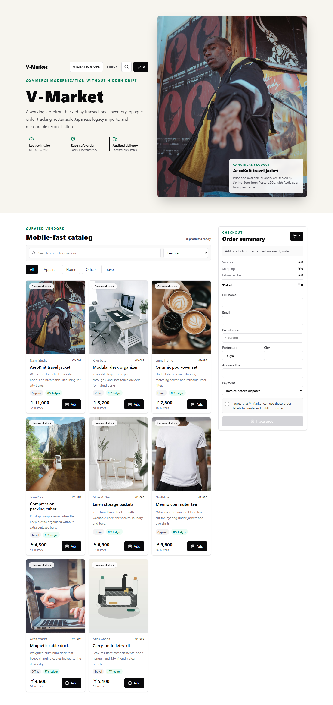
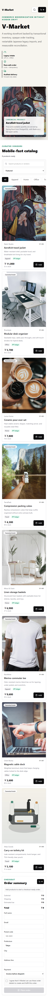

# Live deployment evidence

Validated on 2026-08-20 against the public deployment.

| Layer | Evidence |
| --- | --- |
| Cloudflare Worker + Next.js BFF | `https://v-market.vmarket-vietdung2005.workers.dev` returned HTTP 200 |
| Spring Boot readiness | `https://v-market-api.onrender.com/actuator/health/readiness` returned HTTP 200 |
| PostgreSQL catalog through BFF | `GET /api/catalog/products` returned 8 canonical products |
| Reconciliation API through BFF | `GET /api/ops/reconciliations` returned HTTP 200 |
| Retry-safe checkout | Retrying one synthetic checkout returned the same order; `VM-008` inventory decreased once and the order entered `RECEIVED` |
| Browser QA | Chromium desktop and 390×844 mobile passed with no console errors |

The deployed backend source commit was `79206ea`. Cloudflare injects both the BFF and operations credentials server-side; they are absent from the browser bundle and Git history.

